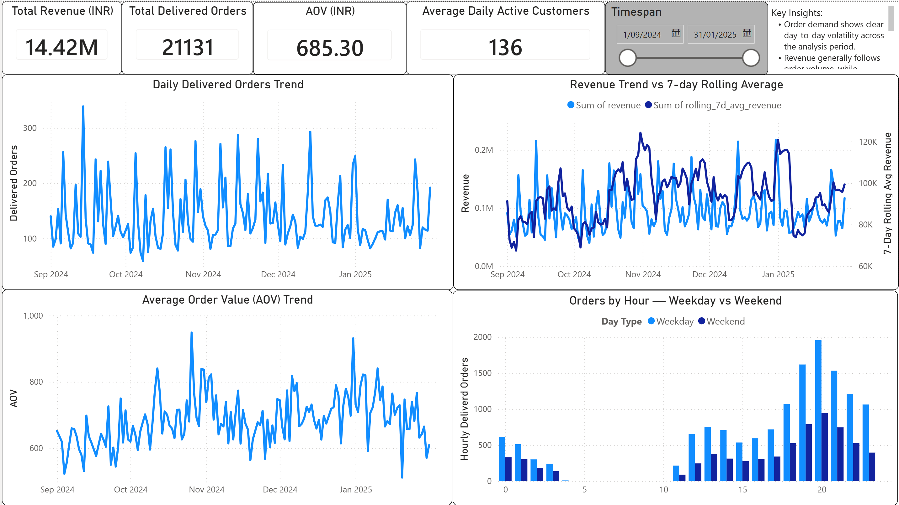
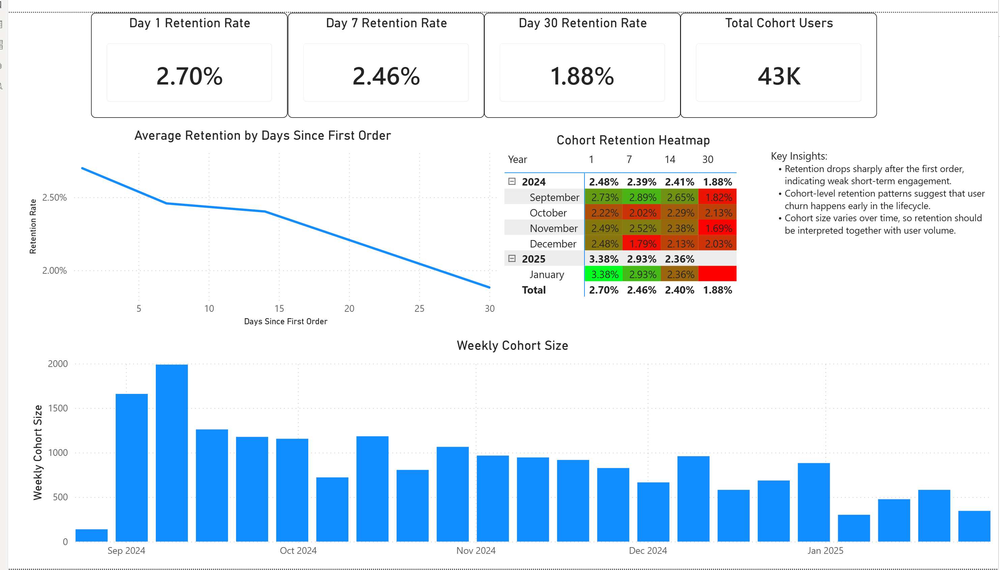
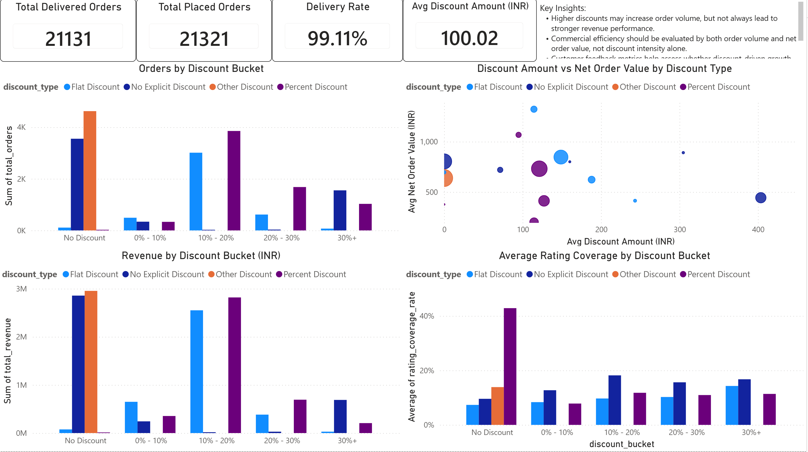
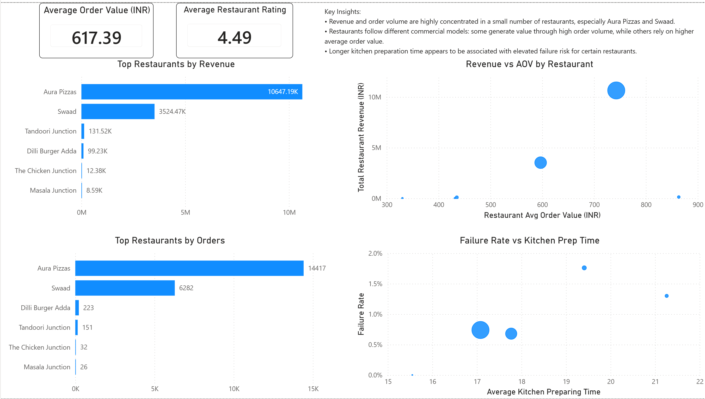
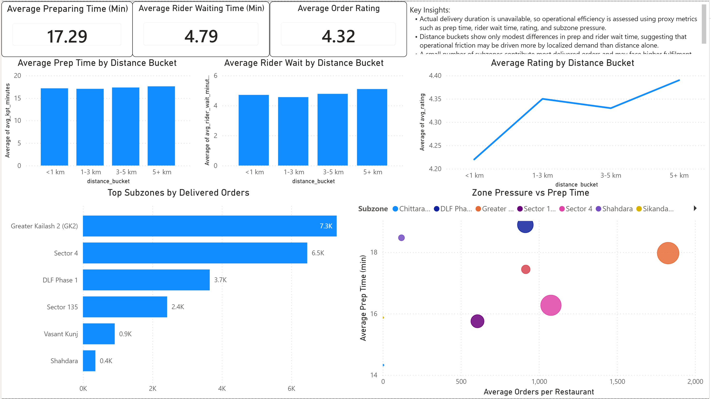

# Food Delivery Commercial & Operational Analytics

## Project Overview
This project analyzes a food delivery platform from both commercial and operational perspectives using SQL and Power BI.

The analysis covers:
- demand and revenue trends
- user retention and cohort behavior
- discount effectiveness
- restaurant-level performance
- operational delivery efficiency

Instead of compressing all findings into one single dashboard page, the report is structured as a multi-page analytical dashboard, where each page addresses a distinct business question.

---

## Business Questions
This project aims to answer the following questions:

1. How do order demand and revenue change over time?
2. Is revenue primarily driven by order volume or average order value?
3. How well does the platform retain users after their first order?
4. Do discounts improve business performance, or simply inflate short-term demand?
5. Which restaurants contribute most to revenue and order volume?
6. Where do operational inefficiencies appear in the fulfillment process?
7. What are the main limitations of the dataset when evaluating delivery performance?

---

## Dataset
The project is based on a food delivery order history dataset containing order-level, restaurant-level, and operational fields.

Key data domains include:
- order timestamps
- restaurant and location information
- order value and discount information
- ratings and reviews
- kitchen preparation time
- rider wait time
- failure and complaint signals

---

## Tools Used
- **MySQL** for data cleaning, transformation, and analytical queries
- **Power BI** for multi-page visual reporting
- **Kaggle dataset** as the raw data source

---

## Data Preparation
The dataset was cleaned and transformed before analysis.

Main preparation steps included:
- standardizing order status fields
- parsing date and time fields
- deriving weekday / weekend features
- creating cohort-based retention tables
- aggregating commercial and operational metrics into themed output tables
- exporting SQL results into CSV files for Power BI reporting

---

## Report Structure

### Page 1 — Demand & Revenue Overview
Focus:
- daily delivered orders trend
- revenue trend and rolling average
- AOV trend
- weekday vs weekend hourly ordering behavior

Key takeaway:
- demand and revenue fluctuate significantly over time
- average order value is relatively more stable than order volume
- weekday and weekend demand patterns differ by hour

---

### Page 2 — Retention & User Behavior
Focus:
- Day 1 / Day 7 / Day 30 retention
- cohort retention curve
- cohort retention heatmap
- cohort size over time

Key takeaway:
- user retention drops sharply after the first order
- churn happens very early in the customer lifecycle
- retention performance should be interpreted together with cohort size

---

### Page 3 — Discount & Commercial Efficiency
Focus:
- orders by discount bucket
- revenue by discount bucket
- discount amount vs net order value
- rating coverage by discount bucket

Key takeaway:
- higher discounts may increase order volume, but do not always lead to stronger commercial performance
- discount effectiveness should be evaluated using both order volume and revenue quality
- discount intensity alone is not a reliable indicator of business value

---

### Page 4 — Restaurant Performance
Focus:
- top restaurants by revenue
- top restaurants by orders
- revenue vs average order value by restaurant
- failure rate vs kitchen prep time

Key takeaway:
- revenue is concentrated among a small number of restaurants
- restaurants generate value through different models: high volume vs high basket size
- longer preparation time may be associated with elevated failure risk for some restaurants

---

### Page 5 — Operational Delivery Efficiency
Focus:
- preparation time by distance bucket
- rider wait time by distance bucket
- rating by distance bucket
- top subzones by delivered orders
- zone pressure vs prep time

Key takeaway:
- operational efficiency varies across distance buckets and subzones
- fulfillment pressure appears to be influenced by localized demand concentration
- subzone-level operational pressure may matter as much as distance

---

## Key Findings

### 1. Demand is volatile
Daily order demand and revenue show clear fluctuations across the analysis period, suggesting unstable traffic and changing demand intensity.

### 2. Revenue is mainly volume-driven
Revenue generally follows delivered order volume more closely than average order value, indicating that traffic and order count are the main growth drivers.

### 3. Early churn is the main retention problem
Retention drops substantially after the first order. This suggests the platform’s biggest user lifecycle problem is short-term retention rather than long-term loyalty alone.

### 4. Discounting does not automatically improve business quality
Some discount buckets generate stronger order counts, but their revenue quality and downstream value are not always proportionally better.

### 5. Business is concentrated among a small set of restaurants
A limited number of restaurants contribute the majority of revenue and orders, which creates concentration risk.

### 6. Operational pressure is unevenly distributed
High-demand subzones appear to face greater strain, and operational proxies such as preparation time and rider wait time help identify likely bottlenecks.

---

## Limitation
A major limitation of the dataset is the absence of actual order delivery completion timestamps.

Because actual delivery duration is unavailable, end-to-end delivery time cannot be measured directly.

As a result, operational efficiency is evaluated using proxy metrics such as:
- kitchen preparation time
- rider wait time
- distance
- readiness accuracy
- failure rate

---

## Future Improvements
If additional fields were available, the analysis could be extended with:
- actual delivery completion timestamp
- promised delivery time
- pickup timestamp
- rider assignment timestamp
- customer-level acquisition source

This would enable:
- end-to-end delivery time analysis
- on-time delivery rate
- SLA compliance analysis
- more robust customer lifecycle modeling

---

## SQL Outputs Used in Power BI
The final report was built from themed SQL output tables, including:
- RevenueDrivers.csv
- OrderDis.csv
- Retention&UserBehavior.csv
- DiscountEffectiveness.csv
- RestaurantPerformance.csv
- RestaurantFailure.csv
- DeliveryEfficiency.csv
- DeliveryTraffic.csv
- FailureAnalysis.csv

---

## Author Notes
This project was designed as a portfolio-ready business analytics case study.  
The focus was not only on visualization, but also on translating raw operational and transaction data into structured business questions, SQL outputs, and actionable insights.